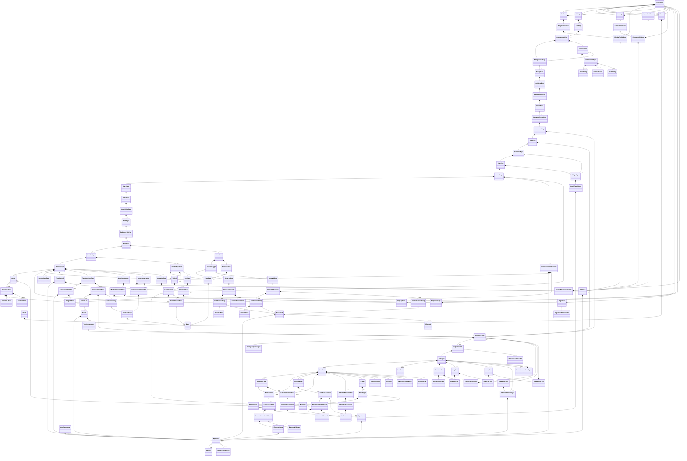

# Class Diagram

```mermaid
classDiagram
    XPath *-- Expr
    ParamList *-- "1..*" Param
    Param *-- EQName
    Param *-- "0..1" TypeDeclaration
    FunctionBody *-- EnclosedExpr
    EnclosedExpr *-- "0..1" Expr
    ExprSingle *-- "enum" ForExpr
    ExprSingle *-- "enum" LetExpr
    ExprSingle *-- "enum" QuantifiedExpr
    ExprSingle *-- "enum" IfExpr
    ExprSingle *-- "enum" OrExpr
    ForExpr *-- SimpleForClause
    ForExpr *-- ExprSingle
    SimpleForClause *-- "1..*" SimpleForBinding
    SimpleForBinding *-- VarName
    SimpleForBinding *-- ExprSingle
    LetExpr *-- SimpleLetClause
    LetExpr *-- ExprSingle
    SimpleLetClause *-- "1..*" SimpleLetBinding
    SimpleLetBinding *-- VarName
    SimpleLetBinding *-- ExprSingle
    QuantifiedExpr *-- "1..*" VarName
    QuantifiedExpr *-- "2..*" ExprSingle
    IfExpr *-- Expr
    IfExpr *-- "2" ExprSingle
    OrExpr *-- "1..*" AndExpr
    AndExpr *-- "1..*" ComparisonExpr
    ComparisonExpr *-- StringConcatExpr
    ComparisonExpr *-- "0..1" Comparison
    Comparison *-- ComparisonType
    ComparisonType *-- "enum" ValueComp
    ComparisonType *-- "enum" GeneralComp
    ComparisonType *-- "enum" NodeComp
    Comparison *-- StringConcatExpr
    StringConcatExpr *-- "1..*" RangeExpr
    RangeExpr *-- "1..2" AdditiveExpr
    AdditiveExpr *-- "1..*" MultiplicativeExpr
    MultiplicativeExpr *-- "1..*" UnionExpr
    UnionExpr *-- "1..*" IntersectExceptExpr
    IntersectExceptExpr *-- "1..*" InstanceofExpr
    InstanceofExpr *-- TreatExpr
    InstanceofExpr *-- "0..1" SequenceType
    TreatExpr *-- CastableExpr
    TreatExpr *-- "0..1" SequenceType
    CastableExpr *-- CastExpr
    CastableExpr *-- "0..1" SingleType
    CastExpr *-- ArrowExpr
    CastExpr *-- "0..1" SingleType
    ArrowExpr *-- UnaryExpr
    ArrowExpr *-- "0..*" ArrowFunctionSpecifier
    ArrowExpr *-- "0..*" ArgumentList
    UnaryExpr *-- ValueExpr
    ValueExpr *-- SimpleMapExpr
    SimpleMapExpr *-- "1..*" PathExpr
    PathExpr *-- RelativePathExpr
    RelativePathExpr *-- "1..*" StepExpr
    StepExpr *-- "enum" PostfixExpr
    StepExpr *-- "enum" AxisStep
    AxisStep *-- AxisStepType
    AxisStepType *-- "enum" ReverseStep
    AxisStepType *-- "enum" ForwardStep
    AxisStep *-- PredicateList
    ForwardStep *-- ForwardStepType
    ForwardStepType *-- "enum" FullForwardStep
    ForwardStepType *-- "enum" AbbrevForwardStep
    AbbrevForwardStep *-- NodeTest
    FullForwardStep *-- ForwardAxis
    FullForwardStep *-- NodeTest
    ReverseStep *-- ReverseStepType
    ReverseStepType *-- "enum" FullReverseStep
    ReverseStepType *-- "enum" AbbrevReverseStep
    FullReverseStep *-- ReverseAxis
    FullReverseStep *-- NodeTest
    NodeTest *-- "enum" EQName
    NodeTest *-- "enum" Wildcard
    PostfixExpr *-- PrimaryExpr
    PostfixExpr *-- "0..*" PostfixExprItem
    PostfixExprItem *-- "enum" Predicate
    PostfixExprItem *-- "enum" ArgumentList
    PostfixExprItem *-- "enum" Lookup
    ArgumentList *-- "1..*" Argument
    PredicateList *-- "0..*" Predicate
    Predicate *-- Expr
    Lookup *-- KeySpecifier
    KeySpecifier *-- "enum" NCName
    KeySpecifier *-- "enum" IntegerLiteral
    KeySpecifier *-- "enum" ParenthesizedExpr
    ArrowFunctionSpecifier *-- "enum" EQName
    ArrowFunctionSpecifier *-- "enum" VarRef
    ArrowFunctionSpecifier *-- "enum" ParenthesizedExpr
    PrimaryExpr *-- "enum" Literal
    PrimaryExpr *-- "enum" VarRef
    PrimaryExpr *-- "enum" ParenthesizedExpr
    PrimaryExpr *-- "enum" ContextItemExpr
    PrimaryExpr *-- "enum" FunctionCall
    PrimaryExpr *-- "enum" FunctionItemExpr
    PrimaryExpr *-- "enum" MapConstructor
    PrimaryExpr *-- "enum" ArrayConstructor
    PrimaryExpr *-- "enum" UnaryLookup
    Literal *-- "enum" NumericLiteral
    Literal *-- "enum" StringLiteral
    NumericLiteral *-- "enum" IntegerLiteral
    NumericLiteral *-- "enum" DecimalLiteral
    NumericLiteral *-- "enum" DoubleLiteral
    VarRef *-- VarName
    VarName *-- EQName
    ParenthesizedExpr *-- Expr
    FunctionCall *-- EQName
    FunctionCall *-- ArgumentList
    Argument *-- ExprSingle
    Argument *-- ArgumentPlaceholder
    FunctionItemExpr *-- "enum" NamedFunctionRef
    FunctionItemExpr *-- "enum" InlineFunctionExpr
    NamedFunctionRef *-- EQName
    NamedFunctionRef *-- IntegerLiteral
    InlineFunctionExpr *-- "0..1" ParamList
    InlineFunctionExpr *-- "0..1" SequenceType
    InlineFunctionExpr *-- FunctionBody
    MapConstructor *-- "1..*" MapConstructorEntry
    MapConstructorEntry *-- MapKeyExpr
    MapConstructorEntry *-- MapValueExpr
    MapKeyExpr *-- ExprSingle
    MapValueExpr *-- ExprSingle
    ArrayConstructor *-- "enum" SquareArrayConstructor
    ArrayConstructor *-- "enum" CurlyArrayConstructor
    SquareArrayConstructor *-- "1..*" ExprSingle
    CurlyArrayConstructor *-- EnclosedExpr
    UnaryLookup *-- KeySpecifier
    SingleType *-- SimpleTypeName
    TypeDeclaration *-- SequenceType
    SequenceType *-- "enum" EmptySequenceType
    SequenceType *-- "enum" SequenceItem
    SequenceItem *-- ItemType
    SequenceItem *-- "0..1" OccurrenceIndicator
    ItemType *-- "enum" KindTest
    ItemType *-- "enum" ItemTest
    ItemType *-- "enum" FunctionTest
    ItemType *-- "enum" MapTest
    ItemType *-- "enum" ArrayTest
    ItemType *-- "enum" AtomicOrUnionType
    ItemType *-- "enum" ParenthesizedItemType
    AtomicOrUnionType *-- EQName
    KindTest *-- "enum" DocumentTest
    KindTest *-- "enum" ElementTest
    KindTest *-- "enum" AttributeTest
    KindTest *-- "enum" SchemaElementTest
    KindTest *-- "enum" SchemaAttributeTest
    KindTest *-- "enum" PITest
    KindTest *-- "enum" CommentTest
    KindTest *-- "enum" TextTest
    KindTest *-- "enum" NamespaceNodeTest
    KindTest *-- "enum" AnyKindTest
    DocumentTest *-- ElementTest
    DocumentTest *-- "0..1" SchemaElementTest
    PITest *-- "0..1" PITestType
    PITestType *-- "enum" NCName
    PITestType *-- "enum" StringLiteral
    AttributeTest *-- "0..1" AttributeTestItem
    AttributeTestItem *-- AttribNameOrWildcard
    AttributeTestItem *-- "0..1" TypeName
    AttribNameOrWildcard *-- "enum" AttributeName
    AttribNameOrWildcard *-- "enum" AttributeWildcard
    SchemaAttributeTest *-- AttributeDeclaration
    AttributeDeclaration *-- AttributeName
    ElementTest *-- "0..1" ElementTestItem
    ElementTestItem *-- ElementNameOrWildcard
    ElementTestItem *-- "0..1" TypeName
    ElementNameOrWildcard *-- "enum" ElementName
    ElementNameOrWildcard *-- "enum" ElementWildcard
    SchemaElementTest *-- ElementDeclaration
    ElementDeclaration *-- ElementName
    Attributename *-- EQName
    ElementName *-- EQName
    SimpleTypeName *-- TypeName
    TypeName *-- EQName
    FunctionTest *-- "enum" AnyFunctionTest
    FunctionTest *-- "enum" TypedFunctionTest
    TypedFunctionTest *-- "0..*" SequenceType
    MapTest *-- "enum" AnyMapTest
    MapTest *-- "enum" TypedMapTest
    TypedMapTest *-- AtomicOrUnionType
    TypedMapTest *-- SequenceType
    ArrayTest *-- "enum" AnyArrayTest
    ArrayTest *-- "enum" TypedArrayTest
    TypedArrayTest *-- SequenceType
    ParenthesizedItemType *-- ItemType
    EQName *-- "enum" QName
    EQName *-- "enum" URIQualifiedName
```
